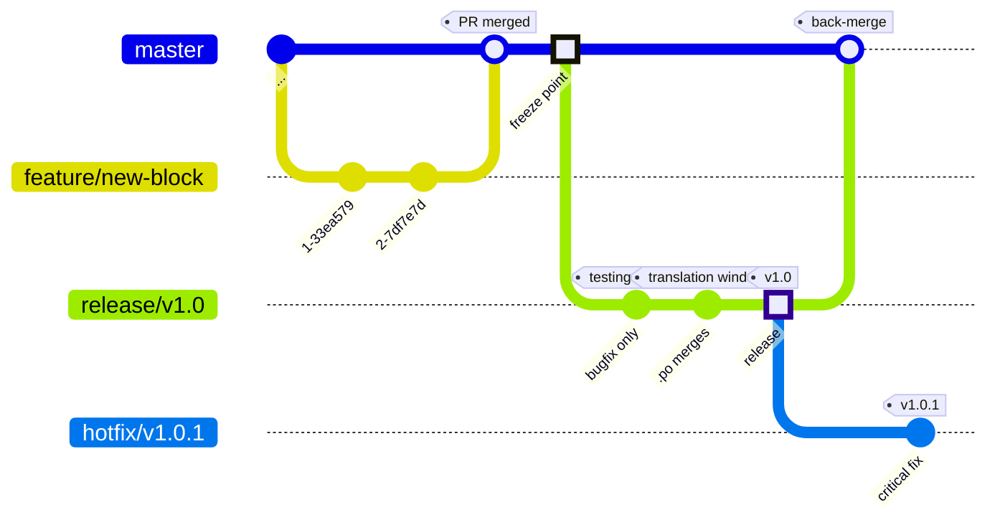
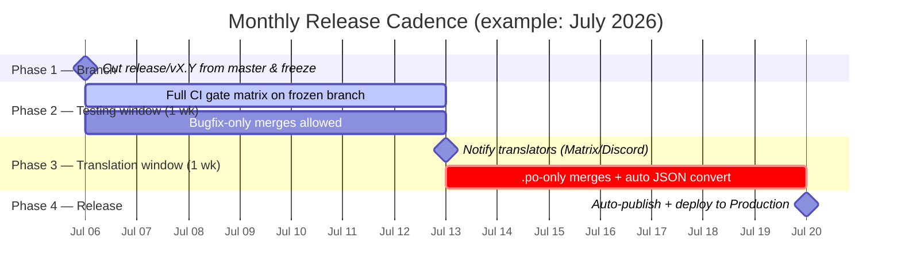
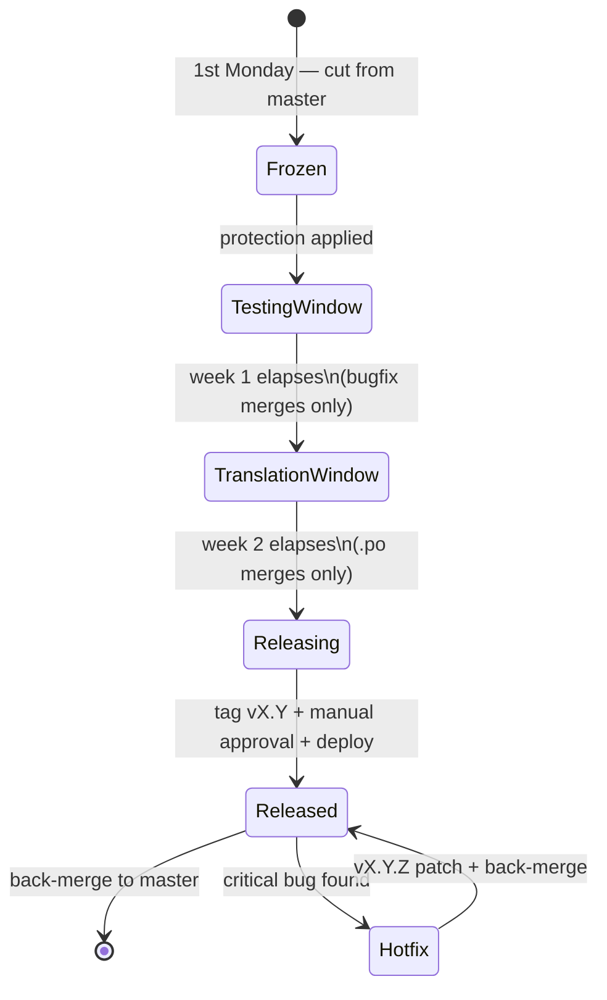
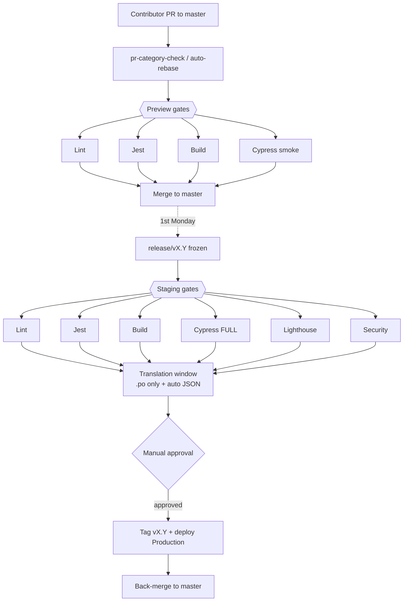

# CI/CD Pipeline Design — Translation & Feature Cadence

**Project:** Music Blocks (`sugarlabs/musicblocks`)
**Status:** Design proposal (no code written yet)
**Scope:** Branching strategy, per-environment quality gates, and a monthly release cadence that gives translators a predictable, frozen target.

---

## 1. Problem statement

Music Blocks has two workstreams running on different clocks. Feature work lands on `master` continuously through PRs. Translation work, scoped to `po/` and `locales/`, has no stable target to aim at — strings shift under translators while they work, so localisation lands irregularly and often stale.

This design resolves the tension **without** giving translations a continuous parallel fast-path (which would re-introduce the moving-target problem from the other direction). Instead it imposes a predictable **monthly cadence**: once a month the codebase is frozen into a release branch, tested, then opened to translators for a fixed window, then released. Urgent corrections — code or translation — get narrow, explicit out-of-band paths so the cadence stays clean.

---

## 2. Design goals

1. **Predictable translation target.** Translators always know when strings freeze and how long they have.
2. **Trunk stays releasable.** `master` is always green; release branches are cut from it, never the reverse.
3. **Reuse what exists.** The 12 current workflows already implement most gates. This design *orchestrates and scopes* them rather than rewriting them.
4. **Non-technical-friendly localisation.** Translators should never need to run Python or rebase — automation handles `convert_po_to_json.py` and JSON commits for them.
5. **Narrow escape hatches.** Exactly two out-of-band paths (code hotfix, translation hotfix), both manually dispatched, both auditable.

---

## 3. Branching model

Three branch types, three lifecycles.

| Branch | Cut from | Merges to | Who/what writes to it | Lifetime |
|---|---|---|---|---|
| `feature/*`, `fix/*` | `master` | `master` (via PR) | Contributors | Until merged |
| `release/vX.Y` | `master` (1st Monday) | `master` (back-merge after release) | `release-cadence.yml` + bugfix/`.po` PRs only | One cadence (~2 weeks) |
| `hotfix/vX.Y.Z` | latest release **tag** | `master` **and** the release tag line | Maintainers (manual dispatch) | Until shipped |

**Rules that make this safe**

- A `release/vX.Y` branch is **frozen on creation**: branch protection allows only PRs labelled `bugfix` (during the testing window) or touching exclusively `po/**` (during the translation window). Everything else is rejected by the cadence guard.
- `master` never merges *into* a release branch. Fixes flow the other way: land on `master` first, then cherry-pick to the release branch if needed. This keeps `master` the single source of truth.
- Hotfixes branch from the **released tag**, not `master`, so an emergency fix doesn't drag in unreleased feature work. After shipping, the hotfix is back-merged to `master`.

---

## 4. Environment model

The spec's Preview / Staging / Production map cleanly onto the branch lifecycle for a static web app like Music Blocks:

| Environment | What it is | Backed by | Purpose |
|---|---|---|---|
| **Preview** | Ephemeral per-PR checks (and optional deploy preview) | `feature/*` PR head | Fast contributor feedback |
| **Staging** | The frozen release candidate | `release/vX.Y` | Full validation + translation |
| **Production** | The published, deployed release | tag `vX.Y` on the release branch | Live users |

This is why the gate matrix tightens as you move right: Preview optimises for *speed of feedback*, Production optimises for *confidence before users see it*.

---

## 5. Quality gate matrix (formalised + mapped to real workflows)

Each gate is implemented by an existing workflow file. The matrix below is the spec's table, made executable by naming the workflow and trigger that enforces each cell.

| Gate | Workflow file | Preview | Staging | Production |
|---|---|:---:|:---:|:---:|
| Lint (ESLint + Prettier) | `linter.yml` | ✅ | ✅ | ✅ |
| Unit tests (Jest) | `pr-jest-tests.yml` | ✅ | ✅ | ✅ |
| Build verification (Gulp) | `node.js.yml` | ✅ | ✅ | ✅ |
| E2E (Cypress) | `pr-cypress-e2e.yml` | ✅ **smoke only** | ✅ full suite | ✅ full suite |
| Lighthouse audit | `lighthouse-ci.yml` | — | ✅ | ✅ |
| Security scan | `security_scan.yml` | — *(advisory)* | ✅ | ✅ |
| Manual approval | GitHub Environment rule | — | — | ✅ |

**Governance / supporting workflows** (not gates, but part of the architecture):

| Workflow | Role |
|---|---|
| `pr-category-check.yml` | PR hygiene — requires a category checkbox, auto-applies `feature` / `bug fix` / `size/*` / `area/*` labels |
| `auto-rebase.yml` | Keeps open PRs rebased on `master` after each push |
| `conflict-check.yml` | Labels `needs-rebase` only when auto-rebase *couldn't* fix it (real conflicts) |
| `po-to-json-validation.yml` | Translation integrity — runs `convert_po_to_json.py`, checks `locales/` is in sync |
| `stale.yml` | Closes PRs idle > 63 days |

---

## 6. Monthly release cadence — the four phases

**Phase 1 — Branch & freeze (1st Monday).** `release-cadence.yml` fires on a schedule, cuts `release/vX.Y` from the current `master`, applies the freeze (branch protection + cadence-guard label rules), and announces the freeze.

**Phase 2 — Testing window (week 1).** The full gate matrix runs against the frozen branch. Only PRs labelled `bugfix` may merge. Fixes are authored on `master` and cherry-picked in, so trunk and branch don't diverge.

**Phase 3 — Translation window (week 2).** The branch is now stable. Translators are auto-notified via Matrix/Discord that strings are ready. **Only changes scoped to `po/**` may merge.** On each `.po` commit, `convert_po_to_json.py` runs automatically and **commits the regenerated `locales/` JSON back** — translators never touch Python (see Finding F5).

**Phase 4 — Release (close of week 2).** The cadence workflow tags `vX.Y`, runs the Production gate set (including manual approval), deploys, and back-merges the release branch into `master`.

### Release branch state machine

---

## 7. New workflows to build

Three workflows don't exist yet. Specs below — triggers, jobs, and guards. (Implementation is the next deliverable; this fixes the contract.)

### 7.1 `release-cadence.yml` — the orchestrator

- **Trigger:** `schedule` every Monday, guarded to fire only on the **first** Monday (`if day-of-month <= 7`), plus `workflow_dispatch` for manual runs. *(GitHub cron can't express "first Monday" directly; the day-of-month guard is the standard workaround.)*
- **Jobs:**
  1. `cut-branch` — create `release/vX.Y` from `master`, compute the next version, push.
  2. `freeze` — apply branch protection via API; require the cadence-guard check on all PRs to the branch.
  3. `announce` — post the freeze + testing-window notice to Matrix/Discord.
- **Phase transitions** are driven by two further scheduled guards (or a stored phase label on the branch): week-1→week-2 flips the merge filter from `bugfix` to `po/**`; week-2 close triggers the release job.
- **Release job:** tag `vX.Y`, run Production gates, request manual approval (GitHub Environment), deploy, back-merge to `master`.

### 7.2 `translation-release.yml` — urgent out-of-band translation hotfix

- **Trigger:** `workflow_dispatch` **only** (no automatic path — that's the whole point; the scheduled window is the default channel).
- **Input:** target `.po` change / PR ref.
- **Jobs:** validate the change is scoped strictly to `po/**` → run `po-to-json-validation.yml` logic → regenerate and commit `locales/` → patch-release against the current production tag → back-merge.
- **Guard:** rejects anything touching non-translation paths, so it can't be used to sneak code out of band.

### 7.3 `hotfix.yml` — critical production code fix

- **Trigger:** `workflow_dispatch` with the offending tag as input.
- **Jobs:** branch `hotfix/vX.Y.Z` from the **release tag** → run the **full** gate matrix → manual approval → deploy → back-merge to `master`.
- **Distinct from 7.2:** this is for *code*; `translation-release.yml` is for *strings*. Different triggers, different review rules, different scopes — don't conflate them.

### Gate flow across environments

---

## 8. Findings from the current workflows (address during implementation)

Reviewing the 12 existing files surfaced five things this design depends on or should fix:

**F1 — `pull_request_target` running fork code is a security risk.** `pr-jest-tests.yml` and `lighthouse-ci.yml` use `pull_request_target` (so they get write tokens to comment on PRs) **and** check out `github.event.pull_request.head.sha`, then run `npm ci` + the project. That executes untrusted fork code with a privileged token — a well-known escalation footgun. Recommendation: split into a low-priv `pull_request` job that runs the code and uploads results as an artifact, and a separate `pull_request_target` job that only reads the artifact to post the comment. This matters more once a Production deploy path exists.

**F2 — E2E has no smoke/full split yet.** `pr-cypress-e2e.yml` runs the entire suite on every PR. The matrix needs **smoke-only on Preview**. Implement with Cypress tags (e.g. `@smoke`) and run `grepTags=@smoke` on Preview, full suite on the release branch. Without this, Preview isn't actually lighter than Staging.

**F3 — "Build Verification (Gulp)" vs the actual `npm run build`.** `node.js.yml` is named *Smoke Test* but its real job is build verification across Node 20/22. The matrix calls this gate "Gulp" — confirm `npm run build` wraps the Gulp build, and rename the workflow so the gate name and file agree. Cosmetic, but reviewers will trip on it.

**F4 — Security scan currently runs on every PR; matrix scopes it to Staging+.** `security_scan.yml` runs `npm audit` on all PRs today. The matrix leaves Preview blank. Suggested reconciliation: keep it **advisory (non-blocking)** on Preview for early signal, **blocking** on Staging/Production. Cheap enough to keep visible, strict only where it gates a release.

**F5 — Translation JSON should auto-commit during the window, not just verify.** Today `po-to-json-validation.yml` *fails* if a contributor didn't run `convert_po_to_json.py` and commit `locales/` themselves. That's fine for code contributors but hostile to translators, who are often non-technical. During the **translation window**, the cadence must run the converter and **commit the JSON for them**. This is the single most important behaviour change for goal #4 — it's what makes the window a genuinely predictable, low-friction target.

---

## 9. What changes vs. today (migration summary)

| Area | Today | After this design |
|---|---|---|
| Release timing | Ad hoc | 1st Monday monthly, automated |
| Translation target | Moving | Frozen 1-week window, announced |
| Environments | PR + master only | Preview / Staging / Production |
| Cypress | Full suite every PR | Smoke on Preview, full on Staging/Prod |
| `.po` → JSON | Contributor runs script | Auto-run + auto-commit in window |
| Out-of-band fixes | Implicit | Two explicit dispatch-only paths |
| New workflows | — | `release-cadence.yml`, `translation-release.yml`, `hotfix.yml` |

---

## 10. Open decisions for reviewers

1. **Deploy target** — where does Production actually publish (GitHub Pages, a CDN, Sugar's infra)? The manual-approval gate and deploy job depend on this.
2. **Version scheme** — `vX.Y` monthly with `.Z` for hotfixes assumed; confirm against any existing tagging convention.
3. **Window length flex** — fixed 1+1 weeks, or shorten in months with few string changes?
4. **Notification ownership** — does the bot post to Matrix, Discord, or both, and who owns the webhook secret?